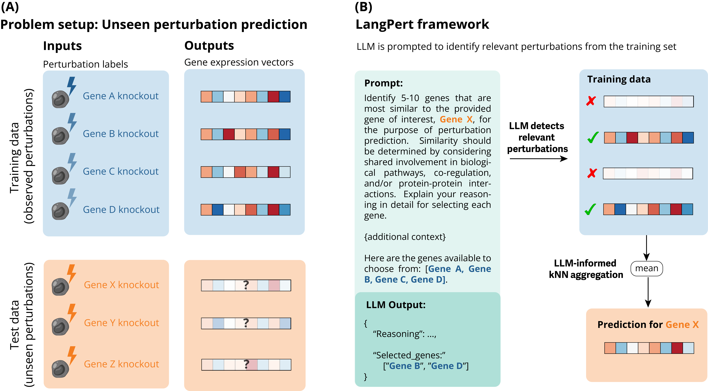

# LangPert

A modular LLM framework for cell perturbation predictions using a novel hybrid LLM-kNN approach.



## Overview

LangPert combines Large Language Models (LLMs) with k-nearest neighbors to predict cellular perturbation effects. The LLM identifies relevant genes from the training set based on its prior knowledge and biological reasoning, and the target gene's prediction is formed by averaging the identified kNN gene set.

This implementation provides flexible backends and prompts so that users can easily experiment with different models and biological contexts. For details on the method, see our [paper](https://openreview.net/forum?id=Tmx4o3Jg55). 

**Supported backends:**

- **API backends**: OpenAI, Google Gemini
- **Local backends**: HuggingFace Transformers, Unsloth-optimized models


## Installation

```bash
uv pip install -e .
```

## Quick Start

In this first example, we'll use Google API (you can get a key from Google AI Studio), but in principle you can use any LLM backend, either API or locally running model.


```python
import os
import numpy as np
import langpert

from langpert import LangPert

# Your observed perturbation data
observed_effects = {
    "TP53": np.random.randn(100),
    "BRCA1": np.random.randn(100),
    "BRCA2": np.random.randn(100),
    "ATM": np.random.randn(100),
    "MDM2": np.random.randn(100),
    "CDKN1A": np.random.randn(100),
    "RPL7": np.random.randn(100),
    "RPS6": np.random.randn(100),
}

# Create a model with Gemini backend
from langpert.backends import gemini_backend

backend = gemini_backend(
    api_key=os.getenv("GOOGLE_API_KEY"),
    model="gemini-2.5-flash",
    temperature=0.2
)

model = LangPert(
    backend=backend,
    observed_effects=observed_effects,
    prompt_template="default"
)

# Single prediction
result = model.predict_perturbation("MYC")

print(f"Inferred gene set: {result.knn_genes}")
print(f"Prediction shape: {result.prediction.shape}")
print(f"LLM reasoning: {result.reasoning[:200]}...")

```

### Using Local Models

For running models locally with HuggingFace Transformers:

```python
from langpert.backends import transformers_backend

backend = transformers_backend(
    model_name="Qwen/Qwen3-32B",
    load_in_4bit=True, 
    device="cuda"
)

model = LangPert(backend=backend, observed_effects=observed_effects)
result = model.predict_perturbation("MYC")
```

Or with Unsloth for optimized inference:

```python
from langpert.backends import unsloth_backend

backend = unsloth_backend(
    model_name="unsloth/Qwen3-14B-unsloth-bnb-4bit",
    load_in_4bit=True
)
```

**Available backends:** 

- `gemini_backend`
- `openai_backend`
- `transformers_backend`
- `unsloth_backend`


## Citation

If you use LangPert in your research, please cite:

```
@inproceedings{martens2025langpert,
  title={LangPert: LLM-Driven Contextual Synthesis for Unseen Perturbation Prediction},
  author={M{\"a}rtens, Kaspar and Martell, Marc Boubnovski and Prada-Medina, Cesar A and Donovan-Maiye, Rory},
  booktitle={ICLR 2025 Workshop on Machine Learning for Genomics Explorations}
}
```
